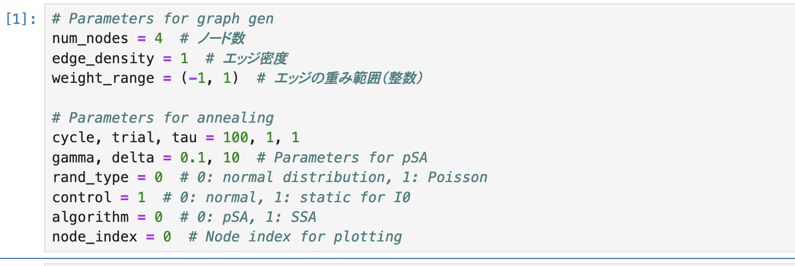
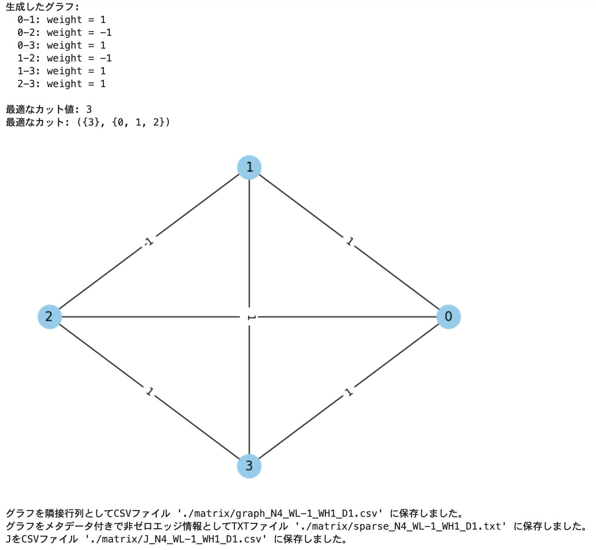
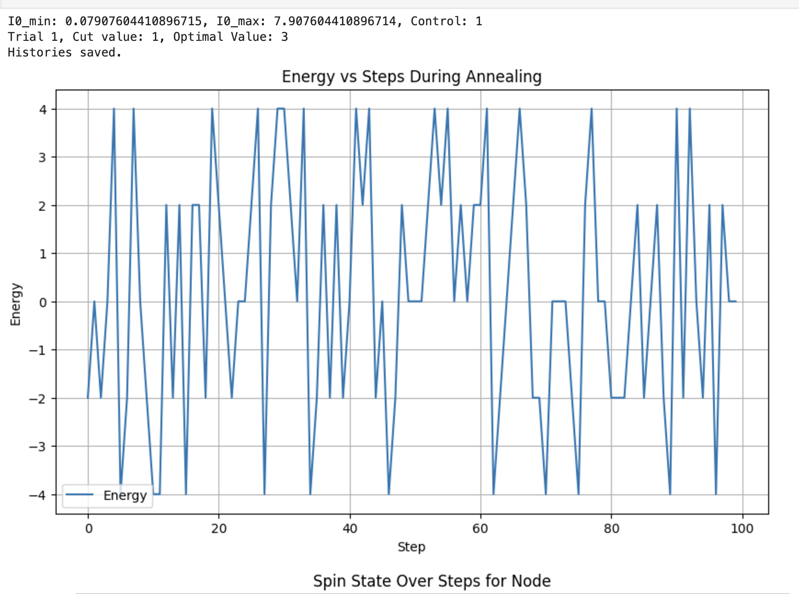
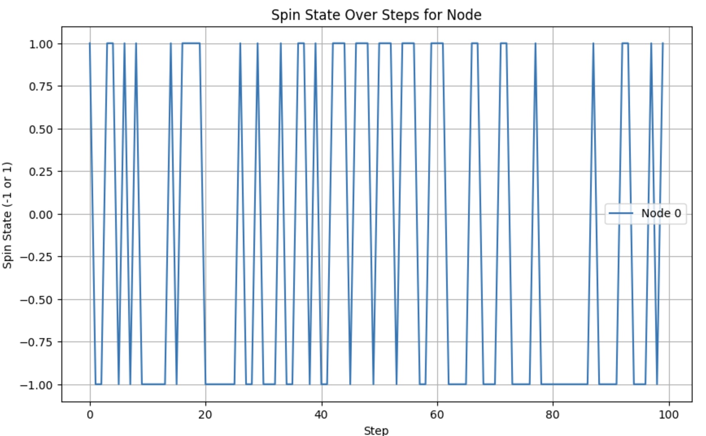

# MAX-CUT graph generation and simulated annealing based on p-bits

This repository contains code and a Jupyter Notebook for generating graphs and running simulated annealing.

## Files
- `graph_gen_annealing.ipynb`: Main notebook.
- `graph_gen.py`: Python script for graph generation.
- `annealing.py`: Python script for implementing the simulated annealing algorithm.

## Setup and Usage Instructions

### 1. Clone the Repository
First, clone the repository to your local machine:
```bash
git clone <your-github-repo-url>
cd graph-gen-annealing
```

### 2. Install Required Packages
Ensure you have Python 3.x installed. Install the required libraries by running:
```bash
pip install -r requirements.txt
```
> Note: If no `requirements.txt` file exists, manually check the scripts and notebook for necessary libraries and install them using `pip`.

### 3. Understand the Files
- **`graph_gen.py`**: Contains functions for generating graphs. You can use this standalone or as part of the notebook.
- **`annealing.py`**: Contains the simulated annealing algorithm. It is modular and can be imported for standalone use or called from the notebook.
- **`graph_gen_annealing.ipynb`**: Combines the functionalities of `graph_gen.py` and `annealing.py` into an interactive environment for running experiments.

### 4. Open the Jupyter Notebook
Launch the Jupyter Notebook server and open the notebook file:
```bash
jupyter notebook graph_gen_annealing.ipynb
```

### 5. Configure Parameters
Below are the main configurable parameters based on the attached scripts:

#### `graph_gen` Parameters
Below are some of the key parameters found in `graph_gen.py`:
```
num_nodes = 4  # Number of nodes
edge_density = 1  # Edge density
weight_range = (-1, 1)  # Ragne of edge weights
```
Modify these parameters in the corresponding Python files or directly in the Jupyter Notebook to customize the graph generation and annealing process.

#### `annealing` Parameters
- **`algorithm`**: Choose the algorithm to use
  - `0`: pSA (Simulated annealing based on p-bits)
  - `1`: SSA (Stochastic simulated annealing)
- **`gamma, delta`**: Hyperparameters for pSA
  - Example: `gamma = 0.1`, `delta = 10`
- **`rand_type`**: Type of random generation
  - `0`: Normal distribution
  - `1`: Poisson distribution
- **`control`**: Execution mode
  - `0`: Normal mode # I0 chnages from I0_min to I0_max
  - `1`: Static mode # I0 remains as I0_min

### 6. Run the Notebook
Follow these steps:
1. Open the notebook in Jupyter.
2. Execute each cell in sequence by pressing `Shift + Enter`.

3. Observe the results and save outputs as needed.




### 7. Output Files
The following outputs can be generated by this project:

1. **Graph Files**: Generated graphs are saved as `.png` or `.jpg` images. 
   - Location: The script or notebook will specify the save path for the generated graphs.
   - Example: `output/graph_visualization.png`

2. **Annealing Results**: Results from the simulated annealing process, such as optimized configurations or energy values, may be saved as:
   - `.txt` files containing energy and parameter logs.
   - `.csv` files summarizing simulation outputs.
   - Example: `output/annealing_results.csv`

Ensure that the `output` directory exists or modify the paths in the scripts/notebook as needed.

#### Output Files and Directories

1. **Result Files**
   Simulation results and histories are saved in the following formats:
   - **History Files**: `spin_history` and `energy_history` are saved.
     - Function: `save_results()`
     - Example outputs: `output/spin_history.txt`, `output/energy_history.txt`

2. **Summary Files**
   Annealing result summaries are saved in `.csv` format.
   - Function: `save_summary()`
   - Default output path: `./result/result_pSA.csv`
   - Format: Energy history and parameters are logged in CSV format.

3. **Directory Structure**
   - **`output/`**: Temporary files such as simulation graphs and intermediate results.
   - **`result/`**: Default directory for saving analysis results.

4. **Notes**
   Ensure that the output directories (`output/` and `result/`) exist before running the scripts. Create them if necessary or modify the paths in the scripts to match your setup.


## License
This project is licensed under the MIT License. See the LICENSE file for more details.


## Contact

For any questions, issues, or inquiries, feel free to create an issue in the repository or contact the repository owner [@nonizawa](https://github.com/nonizawa).

## Citation

This paper describes the SSA algorithm:
```bibtex
@ARTICLE{9743572,
  author={Onizawa, Naoya and Katsuki, Kota and Shin, Duckgyu and Gross, Warren J. and Hanyu, Takahiro},
  journal={IEEE Transactions on Neural Networks and Learning Systems}, 
  title={Fast-Converging Simulated Annealing for Ising Models Based on Integral Stochastic Computing}, 
  year={2023},
  volume={34},
  number={12},
  pages={10999-11005},
  doi={10.1109/TNNLS.2022.3159713}}
```
his paper describes the pSA algorithm:
```bibtex

@article{cite-key,
	Author = {Onizawa, Naoya and Hanyu, Takahiro},
	Da = {2024/01/16},
	Doi = {10.1038/s41598-024-51639-x},
	Id = {Onizawa2024},
	Isbn = {2045-2322},
	Journal = {Scientific Reports},
	Number = {1},
	Pages = {1339},
	Title = {Enhanced convergence in p-bit based simulated annealing with partial deactivation for large-scale combinatorial optimization problems},
	Ty = {JOUR},
	Url = {https://doi.org/10.1038/s41598-024-51639-x},
	Volume = {14},
	Year = {2024},
	Bdsk-Url-1 = {https://doi.org/10.1038/s41598-024-51639-x}}
```

